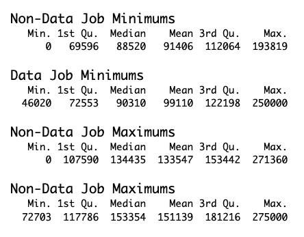
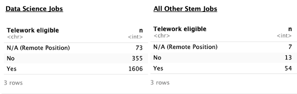
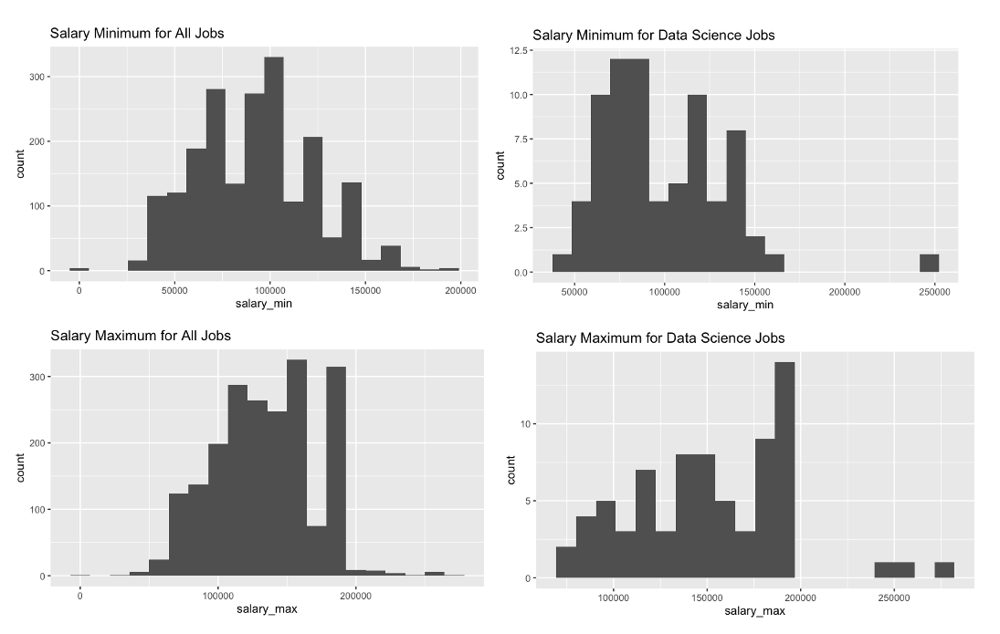

```{r setup, include=FALSE}
knitr::opts_chunk$set(echo = TRUE)
```

A Comparative Analysis of Public Sector Data Science Jobs vs STEM Jobs

As undergraduate and graduate students study and prepare to join the rapidly evolving field of Data Science, it is important to reaffirm the decision to pursue this line of work. After all, there are many STEM professions to choose from. For my research project, I have decided to present the following question for discussion:

RQ1: Do data science jobs provide a better quality of life than their counterparts?

Admittedly, this is a highly subjective matter, thus I will define “quality of life” in more quantifiable terms. Two aspects of the modern job that are highly sought after are “salary” and “telework/remote work eligibility.” Breaking the research question into the following two hypotheses will allow for further examination of “quality of life”:

H1: data science salary ranges are higher than other similar jobs
H2: data science jobs benefit from remote work privileges more than other similar jobs

To find and provide useful data for exploration, I chose to hone in on public sector data science jobs due to their accessibility on the web. Scraping USAJOBS.gov for all job URLs that match the “Data Scientist,” “Data Engineer,” and “Data Analyst” key phrases led to 2000+ current unique job listings. For the purposes of this project, “data science” jobs are defined as posts which were cross-listed on all three search prompts, while “STEM jobs” consist of all postings which only surfaced for 1 or 2 searches. After differentiating the groups this way, I found data scientists are in a slightly better position than their analyst/engineer/scientist counterparts in other fields. 
NOTE: Due to the fact that this project heavily features work in data extraction and transformation, this report will address the decisions and processes involved in scraping before addressing the research questions.
Obtaining data from the internet is straightforward in theory: select a subject, find the relevant data, identify patterns, and scrape the data from websites. In practice, however, it becomes more complex. Web scraping involves many gray areas. While internet data may be publicly accessible, the owners and providers of this data often do not consent to scraping. In fact, the Terms and Conditions users agree to when creating accounts frequently prohibit data extraction. Therefore, the best practice is to target data that does not require an account for access, such as USAJOBS, the U.S. federal government’s public-sector job board.
The first challenge I faced was understanding how HTML is loaded on different websites. HTML can either be static, stored on the server and loaded directly by the browser, or dynamic, generated after the user issues a GET request. Dynamic HTML loading is common on search engines, where the results are generated in real time based on user input. Since the scraping required unique job listings based on specific keywords, a dynamic HTML reader was necessary. While rvest, the method I learned in class, is effective for scraping static HTML, it is not designed for dynamic HTML. Instead, I utilized RSelenium, which could handle and read the HTML after it dynamically loaded.
Each search page on USAJOBS returns up to 50 job listings, so I cycled through the pages until I had collected all the URLs for the three job titles I was researching. The structure of each job listing page was consistent, allowing me to program RSelenium to extract the relevant data into a custom tibble. To ensure I didn’t overload the server, I incorporated Sys.sleep() commands between requests. I scraped 21 unique fields, including job title, hiring agency, salary range, remote/telework options, qualifications, and supervisor status.
After building the initial database, I cleaned the data in preparation for analysis. Each job URL contained a unique 9-digit code at the end, which corresponded to a specific job listing. This code became the Primary Key of my dataset. By joining data from three different searches (for data analysts, scientists, and engineers), I consolidated 400 job listings and identified those most likely to represent "data science" professions. I then split these into two groups—data science and non-data science jobs—enabling me to compare and contrast these categories for further analysis.
Other cleaning steps involved digging further into the data. Salaries, for example, are predominantly reported as annual wages, but some positions listed hourly pay. To standardize these, I multiplied the hourly wage by 2080 (the number of hours in a full-time work year) to align all salaries to an annual format. Additionally, it was necessary to remove extraneous conditions attached to dichotomous options. Categories like "relocation expenses covered," "remote vs. in-person," and "work schedule type" were often recorded in binary formats (e.g., yes/no, remote/in-person, full-time/part-time). However, the values were rarely presented consistently, so I consolidated these responses into meaningful categories.
The histograms and tables below start to show how the data unfolded. Data science jobs had higher means and medians at both ends of the salary range, and the counts for telework eligibility are broken down by job type. 



 


 


 


Hypothesis 1: data science salary ranges are higher than other similar jobs. Or:

H0: Data science jobs pay the same as other STEM jobs
H1: Data science jobs pay better than other STEM jobs

Salaries’ ranges in this data set provide high quality continuous discreet data for analysis. Indeed, contrasting the data science group vs the field proves to favor the former. Utilizing two-tailed unpaired t-tests on the two groups, the difference of the means of both the minimums (p = 0.034) and the maximums (p < 0.0001) are statistically significant. The mean difference between the minimums is $7,704.21, with a 95% confidence interval ranging from $565.70 to $14,842.72. The mean difference between the maximums is $17,591.80 (95% CI: $9031.71 – $26,151.88). Thus, we can conclude it is highly improbable that the difference in salary ranges is not due to chance based on sample selection and favor the alternate hypothesis that data science jobs are more highly paid. 

H2: data science jobs benefit from remote work privileges more than other similar jobs

Of the 74 jobs available for data scientists at the moment, 7 (9.46%) are fully remote, 54 are eligible for telework (72.97%), and 13 are exclusively in office positions (17.57%). Of the 2034 other professions scraped, 73 are remote (3.59%), 1,606 have telework availability (78.96%), and 355 (17.45%) are in-office positions. There are nearly identical proportions of required in-office work between the two groups. If this sample in time is representative of the entire population of scientist/analyst/engineer public sector jobs, then the main difference between the two groups is that roughly six percent of telework jobs are fully remote in the data science field.
Data science students should rejoice based on these findings. However, the Scope of Inference should not be forgotten. This data is purely observational, thus correlation can be examined but causation should not be assessed. Not only does the data only cover public sector positions, there is no longevity to these observations. The data only reflect a snapshot of the job market in December. Therefore, bias can certainly be introduced based on what jobs are made available (or unavailable) throughout the year. Lastly, using keywords to search engineering, analyst, and scientist jobs is likely not all encompassing of the STEM opportunities that are available. All this considered, it is still promising to see higher rates of remote work and higher salary ranges belonging to “data science” positions. 
This project was a great opportunity to work on my data science skills: extraction, transformation, analysis, statistics, and more. I hope the amount of work I put into scraping USAJOBs makes up for a more simplistic statistical analysis, as these are all important qualities to a successful data scientist. There are more research questions with this data that I unfortunately did not have the time to pursue. Among other questions, future analysis will include reviewing the qualifications paragraphs that were obtained and finding word frequencies to determine the most sought after skills in this field. Until then, I can rest easier knowing that I made the right choice to become a data scientist
